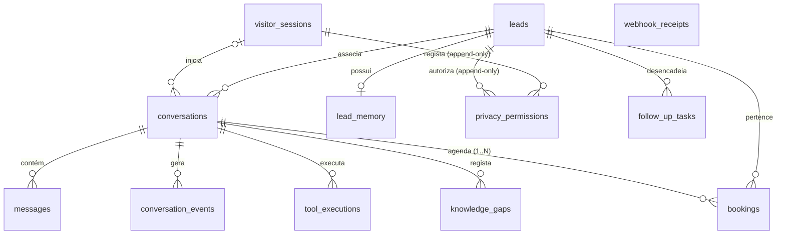

# 10_COMMERCIAL_AGENT_DATA_ARCHITECTURE.md

# Especificação da Arquitectura de Dados do Agente Comercial Lumyo

## 1. Princípios Gerais de Arquitectura de Dados

1. **Fonte Canónica vs. Índice Derivado**:
   - O ficheiro [`09_LUMYO_COMMERCIAL_KNOWLEDGE_BASE.md`](./09_LUMYO_COMMERCIAL_KNOWLEDGE_BASE.md) é a única fonte canónica oficial de conhecimento empresarial da Lumyo.
   - O OpenAI Vector Store é um **índice derivado recriável** a qualquer momento. Nunca é a fonte primária de verdade.
2. **PostgreSQL Relacional para Dados Operacionais**: O Supabase/PostgreSQL é a fonte primária para dados operacionais (sessões, conversas, mensagens, leads, agendamentos, tarefas e eventos). Dados estruturados relacionais **nunca são guardados no Vector Store**.
3. **Separação entre Mensagens e Eventos**:
   - **Mensagens**: Transcrição do diálogo conversacional e chamadas de ferramentas.
   - **Eventos**: Telemetria analítica append-only para auditoria e medição de funil.
4. **Imutabilidade e Retenção de Eventos**: Eventos são imutáveis na operação normal, mas podem ser eliminados ou ter referências removidas para cumprimento de retenção e obrigações jurídicas.
5. **Separação entre Factos e Inferências**: Na qualificação e memória, dados confirmados pelo utilizador são armazenados separadamente de inferências propostas pelo modelo.
6. **Segredos e Credenciais Ocultos**: Chaves de API, tokens de acesso, credenciais de webhooks e prompts de sistema nunca são armazenados em mensagens ou payloads de eventos.
7. **Minimização de Dados e Privacy by Design**: Recolha estritamente limitada aos dados necessários para prestação do serviço e qualificação comercial.
8. **Operações Sensíveis Exclusivamente Server-Side**: O cliente (browser) comunica apenas através de endpoints API server-side seguros com controlo de acessos rigoroso.
9. **Padronização Temporal e Identificadores**: Datas/horas em UTC (`TIMESTAMPTZ`); identificadores únicos em formato `UUIDv4`.
10. **Versionamento de Schemas**: Eventos, regras de qualificação, avaliador orçamental e avisos de privacidade incluem versionamento explícito (`event_version`, `rule_version`, `notice_version`).

---

## 2. Visão Geral das Entidades do Modelo

| Entidade | Papel e Finalidade Principal |
| :--- | :--- |
| `leads` | Oportunidades comerciais com dados estruturados (permitindo múltiplos registos do mesmo email). |
| `visitor_sessions` | Gestão de sessões técnicas anónimas ou ligadas a leads via tokens opacos. |
| `conversations` | Registo e controlo de estado e ciclo de vida da conversa comercial. |
| `messages` | Histórico ordenado de mensagens trocadas, chamadas de ferramentas e avisos. |
| `lead_memory` | Resumo relacional e factos confirmados para leads identificadas (linha única por lead no MVP). |
| `privacy_permissions` | Registo append-only de decisões e acontecimentos de privacidade e permissões. |
| `bookings` | Estado e integração de reuniões agendadas via Cal.com e Google Calendar. |
| `follow_up_tasks` | Fila persistente de tarefas e notificações pós-conversa. |
| `webhook_receipts` | Registo e idempotência de recepção física de webhooks de serviços externos. |
| `tool_executions` | Auditoria de chamadas, duração e estados de ferramentas server-side. |
| `knowledge_gaps` | Registo de dúvidas não respondidas e sinalizações de baixa confiança (com PII redigida). |
| `conversation_events` | Registo de telemetria analítica append-only. |

---

## 3. Especificação Detalhada das Entidades e Políticas `ON DELETE`

### 3.1. `leads`
- **Finalidade**: Armazenar a informação comercial estruturada de cada oportunidade de negócio.
- **Deduplicação & Múltiplas Oportunidades**: O campo `email` **não possui restrição UNIQUE**. O mesmo utilizador/contacto pode criar múltiplas oportunidades (leads) distintas ao longo do tempo. Não se implementa uma tabela de `contacts` nesta fase; a deduplicação e agregação comercial é gerida pelo backend.
- **Campos**:
  - `id` (`UUID`, PK, `gen_random_uuid()`)
  - `email` (`VARCHAR(200)`, NULL) — Email bruto declarado
  - `email_normalized` (`VARCHAR(200)`, NULL, GENERATED ALWAYS AS (lower(trim(email))) STORED) — Email em minúsculas e sem espaços (com índice normal para pesquisa)
  - `name` (`VARCHAR(120)`, NULL)
  - `phone` (`VARCHAR(50)`, NULL) — Canal de contacto telefónico alternativo
  - `company_name` (`VARCHAR(120)`, NULL) — Nome da empresa do visitante
  - `website_url` (`VARCHAR(250)`, NULL) — URL do website do visitante
  - `language` (`VARCHAR(5)`, NOT NULL, DEFAULT `'pt'`) — Idioma da interação (`pt`, `en`)
  - `primary_service` (`VARCHAR(50)`, NULL) — Serviço principal (`websites`, `automation`, `ai`, `digital_growth`)
  - `secondary_services` (`JSONB`, NOT NULL, DEFAULT `'[]'::jsonb`) — Lista de serviços secundários/complementares
  - `need_description` (`TEXT`, NULL) — Descrição detalhada da necessidade/dor do visitante
  - `operational_impact` (`TEXT`, NULL) — Impacto operacional/financeiro do problema
  - `timeline` (`VARCHAR(50)`, NULL) — Prazo/urgência do projecto
  - `decision_involvement` (`VARCHAR(50)`, NULL) — Envolvimento/papel no processo de decisão
  - `intent_level` (`VARCHAR(30)`, NULL) — Nível de intenção comercial
  - `stated_budget_raw` (`TEXT`, NULL) — Texto bruto original fornecido pelo visitante
  - `stated_budget_min` (`NUMERIC(12,2)`, NULL) — Valor mínimo extraído e validado
  - `stated_budget_max` (`NUMERIC(12,2)`, NULL) — Valor máximo extraído e validado
  - `stated_budget_currency` (`CHAR(3)`, NULL, DEFAULT `'EUR'`) — Moeda em formato ISO 4217
  - `stated_budget_period` (`VARCHAR(20)`, NOT NULL, DEFAULT `'unknown'`) — Período (`project`, `monthly`, `unknown`)
  - `budget_normalization_source` (`VARCHAR(30)`, NOT NULL, DEFAULT `'unknown'`) — Origem da captura (`visitor_structured`, `model_extracted`, `human`, `unknown`)
  - `budget_normalization_status` (`VARCHAR(20)`, NOT NULL, DEFAULT `'not_attempted'`) — Estado da normalização (`not_attempted`, `normalized`, `ambiguous`, `invalid`)
  - `financial_alignment_status` (`VARCHAR(25)`, NOT NULL, DEFAULT `'unknown'`) — Resultado qualitativo retornado pelo avaliador determinístico server-side (`aligned`, `possibly_low`, `low_alignment`, `unknown`)
  - `financial_alignment_reason` (`TEXT`, NULL) — Justificação da avaliação financeira privada (preenchida apenas pelo backend)
  - `financial_rule_version` (`VARCHAR(20)`, NULL) — Versão da regra determinística orçamental utilizada (preenchida apenas pelo backend)
  - `financial_evaluated_at` (`TIMESTAMPTZ`, NULL) — Timestamp da avaliação orçamental (preenchida apenas pelo backend)
  - `lead_classification` (`VARCHAR(20)`, NOT NULL, DEFAULT `'informational'`) — Classificação comercial atribuída por regras de backend (`informational`, `potential`, `qualified`, `priority`, `disqualified`)
  - `classification_reason` (`TEXT`, NULL) — Justificação qualitativa da classificação atribuída
  - `qualification_summary` (`TEXT`, NULL) — Síntese para leitura humana (não substitui os campos estruturados de qualificação)
  - `next_step` (`VARCHAR(50)`, NULL) — Próximo passo comercial recomendado
  - `assigned_to` (`VARCHAR(120)`, NULL) — Atribuição provisória textual a um colaborador Lumyo (no MVP)
  - `source` (`VARCHAR(50)`, NOT NULL, DEFAULT `'website_agent'`) — Origem do registo
  - `last_interaction_at` (`TIMESTAMPTZ`, NOT NULL, DEFAULT `now()`) — Timestamp da última interação
  - `created_at` (`TIMESTAMPTZ`, NOT NULL, DEFAULT `now()`) — Timestamp de criação da lead
  - `updated_at` (`TIMESTAMPTZ`, NOT NULL, DEFAULT `now()`) — Timestamp de atualização da lead
- **Índices**: PK (`id`), Index (`email_normalized`), Index (`primary_service`), Index (`lead_classification`), Index (`financial_alignment_status`), Index (`last_interaction_at`).
- **Regras Funcionais da Entidade**:
  - `qualification_summary` é uma síntese para leitura humana e não substitui os campos estruturados (`need_description`, `timeline`, `decision_involvement`, etc.);
  - `financial_alignment_reason`, `financial_rule_version` e `financial_evaluated_at` são preenchidos exclusivamente pelo backend determinístico;
  - O modelo de IA **nunca consulta a matriz privada de preços** nem recebe valores numéricos limiares;
  - `assigned_to` é provisoriamente um campo de texto livre no MVP e deverá tornar-se uma referência a um utilizador interno quando existir essa entidade/domínio no sistema;
  - A inexistência ou omissão de orçamento não constitui, isoladamente, motivo para atribuir `lead_classification = 'disqualified'`. A classificação resulta dos restantes sinais observáveis e regras comerciais validadas.

### 3.2. `visitor_sessions`
- **Finalidade**: Identificar tecnicamente o visitante anónimo antes da atribuição de contacto.
- **Campos**:
  - `id` (`UUID`, PK, `gen_random_uuid()`)
  - `session_token_hash` (`VARCHAR(64)`, NOT NULL, UNIQUE) — SHA-256 hexadecimal minúsculo do token opaco
  - `lead_id` (`UUID`, NULL, FK `leads.id` `ON DELETE SET NULL`) — Ligação opcional à lead
  - `created_at` (`TIMESTAMPTZ`, NOT NULL, DEFAULT `now()`)
  - `last_seen_at` (`TIMESTAMPTZ`, NOT NULL, DEFAULT `now()`)
  - `expires_at` (`TIMESTAMPTZ`, NOT NULL) — Expiração técnica (máximo 30 dias após criação)
  - `ip_hash` (`VARCHAR(64)`, NULL) — HMAC-SHA-256 hexadecimal minúsculo opcional do IP
  - `user_agent_hash` (`VARCHAR(64)`, NULL) — HMAC-SHA-256 hexadecimal minúsculo opcional do user-agent
- **Regras Criptográficas e de Privacidade**:
  - O token de sessão original é opaco, aleatório e de elevada entropia;
  - O token original **nunca é guardado** na base de dados;
  - `session_token_hash` armazena o hash SHA-256 hexadecimal minúsculo (exactamente 64 caracteres hexadecimais: `^[0-9a-f]{64}$`);
  - `ip_hash` armazena opcionalmente o HMAC-SHA-256 hexadecimal minúsculo do IP (exactamente 64 caracteres hexadecimais: `^[0-9a-f]{64}$`);
  - `user_agent_hash` armazena opcionalmente o HMAC-SHA-256 hexadecimal minúsculo do user-agent (exactamente 64 caracteres hexadecimais: `^[0-9a-f]{64}$`);
  - O segredo HMAC para cálculo dos hashes existe exclusivamente no backend privado;
  - Endereços IP e user-agents brutos **nunca são guardados** nestes campos nem em logs operacionais de base de dados;
  - Possuir o UUID da sessão (`id`) não constitui autorização.
- **Constraints Exactas**:
  - `uq_visitor_sessions_session_token_hash`: UNIQUE (`session_token_hash`);
  - `fk_visitor_sessions_lead`: FK `lead_id` -> `public.leads(id)` `ON DELETE SET NULL`;
  - `chk_visitor_sessions_token_hash_format`: `CHECK (session_token_hash ~ '^[0-9a-f]{64}$')`;
  - `chk_visitor_sessions_ip_hash_format`: `CHECK (ip_hash IS NULL OR ip_hash ~ '^[0-9a-f]{64}$')`;
  - `chk_visitor_sessions_user_agent_hash_format`: `CHECK (user_agent_hash IS NULL OR user_agent_hash ~ '^[0-9a-f]{64}$')`;
  - `chk_visitor_sessions_expiry_after_creation`: `CHECK (expires_at > created_at)`;
  - `chk_visitor_sessions_maximum_duration`: `CHECK (expires_at <= created_at + INTERVAL '30 days')`;
  - `chk_visitor_sessions_last_seen_after_creation`: `CHECK (last_seen_at >= created_at)`;
  - `chk_visitor_sessions_last_seen_before_expiry`: `CHECK (last_seen_at <= expires_at)`.
- **Índices Exactos**:
  - Primary Key `id` (`visitor_sessions_pkey`);
  - Unique Index `session_token_hash` (`uq_visitor_sessions_session_token_hash`);
  - Index `lead_id` (`idx_visitor_sessions_lead_id`);
  - Index `expires_at` (`idx_visitor_sessions_expires_at`).
- **Justificação `ON DELETE SET NULL` em `lead_id`**: Se uma lead for eliminada ou anonimizada por pedido de privacidade, a sessão técnica mantém-se sem quebrar registos anónimos de tráfego, definindo `lead_id = NULL`.

### 3.3. `conversations`
- **Finalidade**: Gerir o estado, etapa comercial e resultado da interacção.
- **Campos**:
  - `id` (`UUID`, PK, `gen_random_uuid()`)
  - `session_id` (`UUID`, NULL, FK `visitor_sessions.id` `ON DELETE SET NULL`)
  - `lead_id` (`UUID`, NULL, FK `leads.id` `ON DELETE SET NULL`)
  - `status` (`VARCHAR(20)`, NOT NULL, DEFAULT `'active'`) — `active`, `inactive`, `completed`, `escalated`, `archived`
  - `commercial_stage` (`VARCHAR(30)`, NOT NULL, DEFAULT `'discovery'`) — `discovery`, `exploring_need`, `qualifying`, `suggesting_booking`, `booking_in_progress`, `closed`
  - `primary_outcome` (`VARCHAR(35)`, NULL) — `information_only`, `lead_captured`, `lead_qualified`, `meeting_booked`, `human_handoff`, `not_interested`, `possible_abandonment`, `abandoned_before_contact`, `abandoned_during_qualification`, `abandoned_during_booking`, `technical_failure`, `spam_detected`. *Preenchido apenas no encerramento ou classificação posterior.*
  - `language` (`VARCHAR(5)`, NOT NULL, DEFAULT `'pt'`)
  - `last_activity_at` (`TIMESTAMPTZ`, NOT NULL, `now()`)
  - `closed_at` (`TIMESTAMPTZ`, NULL)
  - `created_at` (`TIMESTAMPTZ`, NOT NULL, `now()`)
  - `updated_at` (`TIMESTAMPTZ`, NOT NULL, `now()`)
- **Constraints**:
  - `status IN ('active', 'inactive', 'completed', 'escalated', 'archived')`
  - `(status IN ('completed', 'escalated', 'archived') AND closed_at IS NOT NULL) OR (status IN ('active', 'inactive') AND closed_at IS NULL)`
- **Justificação `ON DELETE SET NULL` em `session_id`**: Uma conversa activa deve possuir uma sessão válida ao ser criada e utilizada. No entanto, quando a sessão técnica anónima for eliminada ao fim de 30 dias por retenção, a referência passa a `NULL`, permitindo que a conversa anónima seja preservada durante 90 dias sem violação de chave estrangeira.

### 3.4. `messages`
- **Finalidade**: Armazenar o histórico ordenado de mensagens da conversa.
- **Campos**:
  - `id` (`UUID`, PK, `gen_random_uuid()`)
  - `conversation_id` (`UUID`, NOT NULL, FK `conversations.id` `ON DELETE CASCADE`)
  - `sequence_number` (`BIGINT`, NOT NULL) — Sequência incremental por conversa
  - `message_type` (`VARCHAR(20)`, NOT NULL, DEFAULT `'visitor_text'`) — `visitor_text`, `agent_text`, `tool_call`, `tool_result`, `system_notice`
  - `sender_role` (`VARCHAR(15)`, NOT NULL) — `visitor`, `agent`, `system`, `tool`
  - `content` (`TEXT`, NOT NULL) — Limite conceptual de 2.000 carateres (visitante) e 4.000 carateres (agente)
  - `status` (`VARCHAR(15)`, NOT NULL, DEFAULT `'delivered'`) — `pending`, `delivered`, `failed`
  - `openai_response_id` (`VARCHAR(100)`, NULL)
  - `tool_call_id` (`VARCHAR(100)`, NULL)
  - `created_at` (`TIMESTAMPTZ`, NOT NULL, `now()`)
- **Constraints & Uniques**: UNIQUE (`conversation_id`, `sequence_number`). Prompts de sistema e instruções internas NUNCA são persistidos como mensagens visíveis.
- **Justificação `ON DELETE CASCADE` em `conversation_id`**: A remoção de uma conversa elimina as suas mensagens em cascata.

### 3.5. `lead_memory`
- **Finalidade**: Resumo relacional consolidado para a lead activa (linha única por lead no MVP).
- **Campos & Regras**:
  - `id` (`UUID`, PK, `gen_random_uuid()`)
  - `lead_id` (`UUID`, NOT NULL, UNIQUE, FK `leads.id` `ON DELETE CASCADE`)
  - `summary_text` (`TEXT`, NOT NULL)
  - `confirmed_facts` (`JSONB`, NOT NULL, DEFAULT `'{}'::jsonb`)
  - `inferences` (`JSONB`, NOT NULL, DEFAULT `'{}'::jsonb`)
  - `version` (`INT`, NOT NULL, DEFAULT 1) — **Utilizado exclusivamente para controlo de concorrência optimista**
  - `last_source_conversation_id` (`UUID`, NULL, FK `conversations.id` `ON DELETE SET NULL`) — Identifica a última conversa usada na consolidação
  - `updated_at` (`TIMESTAMPTZ`, NOT NULL, `now()`)
  - `expires_at` (`TIMESTAMPTZ`, NULL)
- **Nota**: O campo `version` serve apenas para concorrência optimista. **Não existe um histórico completo de versões da memória no MVP**. O histórico original permanece na tabela `messages` e a memória pode ser reconstruída a qualquer momento a partir das mensagens.

### 3.6. `privacy_permissions`
- **Finalidade**: Registo append-only de decisões e acontecimentos de privacidade.
- **Campos**:
  - `id` (`UUID`, PK, `gen_random_uuid()`)
  - `session_id` (`UUID`, NULL, FK `visitor_sessions.id` `ON DELETE SET NULL`)
  - `lead_id` (`UUID`, NULL, FK `leads.id` `ON DELETE SET NULL`)
  - `notice_version` (`VARCHAR(20)`, NOT NULL)
  - `purpose` (`VARCHAR(50)`, NOT NULL) — `inquiry_response`, `qualification`, `booking_service`, `commercial_followup`
  - `action` (`VARCHAR(30)`, NOT NULL) — `notice_presented`, `permission_granted`, `permission_declined`, `permission_revoked`
  - `occurred_at` (`TIMESTAMPTZ`, NOT NULL, `now()`)
  - `source` (`VARCHAR(50)`, NOT NULL, DEFAULT `'chat_widget'`)
  - `evidence_metadata` (`JSONB`, NOT NULL, DEFAULT `'{}'::jsonb`) — Hashes de IP e UA
  - `created_at` (`TIMESTAMPTZ`, NOT NULL, `now()`)
- **Justificação `ON DELETE SET NULL`**: Os identificadores `session_id` e `lead_id` podem ser removidos por políticas de retenção ou pedidos de eliminação (`SET NULL`), preservando o acontecimento histórico de privacidade como registo auditável sem manter associações pessoais desnecessárias.

### 3.7. `bookings`
- **Finalidade**: Estado e gestão de agendamentos (suporta múltiplas reuniões por conversa).
- **Campos**:
  - `id` (`UUID`, PK, `gen_random_uuid()`)
  - `conversation_id` (`UUID`, NOT NULL, FK `conversations.id` `ON DELETE RESTRICT`)
  - `lead_id` (`UUID`, NOT NULL, FK `leads.id` `ON DELETE RESTRICT`)
  - `cal_booking_id` (`VARCHAR(100)`, NOT NULL, UNIQUE)
  - `google_calendar_event_id` (`VARCHAR(150)`, NULL)
  - `status` (`VARCHAR(20)`, NOT NULL, DEFAULT `'pending'`) — `pending`, `confirmed`, `rescheduled`, `cancelled`, `failed`
  - `start_time` (`TIMESTAMPTZ`, NOT NULL)
  - `end_time` (`TIMESTAMPTZ`, NOT NULL)
  - `protected_buffer_end` (`TIMESTAMPTZ`, NOT NULL)
  - `timezone` (`VARCHAR(50)`, NOT NULL, DEFAULT `'Europe/Lisbon'`)
  - `language` (`VARCHAR(5)`, NOT NULL, DEFAULT `'pt'`)
  - `cancellation_reason` (`TEXT`, NULL)
  - `external_payload_hash` (`VARCHAR(64)`, NULL)
  - `idempotency_key` (`VARCHAR(100)`, NULL, UNIQUE)
  - `created_at` (`TIMESTAMPTZ`, NOT NULL, `now()`)
  - `updated_at` (`TIMESTAMPTZ`, NOT NULL, `now()`)

### 3.8. `webhook_receipts`
- **Finalidade**: Registo de recepção física e controlo de idempotência de webhooks externos.
- **Campos**:
  - `id` (`UUID`, PK, `gen_random_uuid()`)
  - `provider` (`VARCHAR(30)`, NOT NULL) — `cal_com`, `resend`
  - `external_event_id` (`VARCHAR(100)`, NOT NULL)
  - `event_type` (`VARCHAR(60)`, NOT NULL)
  - `payload_hash` (`VARCHAR(64)`, NOT NULL)
  - `processing_status` (`VARCHAR(20)`, NOT NULL, DEFAULT `'received'`) — `received`, `processed`, `duplicate`, `failed`, `ignored`
  - `failure_reason` (`TEXT`, NULL)
  - `received_at` (`TIMESTAMPTZ`, NOT NULL, `now()`)
  - `processed_at` (`TIMESTAMPTZ`, NULL)
- **Constraints & Uniques**: UNIQUE (`provider`, `external_event_id`). Payloads integrais não são guardados salvo necessidade justificável.

### 3.9. `follow_up_tasks`
- **Finalidade**: Fila persistente de acompanhamento pós-conversa.
- **Campos**:
  - `id` (`UUID`, PK, `gen_random_uuid()`)
  - `lead_id` (`UUID`, NOT NULL, FK `leads.id` `ON DELETE RESTRICT`)
  - `conversation_id` (`UUID`, NOT NULL, FK `conversations.id` `ON DELETE RESTRICT`)
  - `task_type` (`VARCHAR(30)`, NOT NULL) — `email_summary`, `commercial_alert`, `inactivity_nudge`
  - `recipient_email` (`VARCHAR(200)`, NOT NULL)
  - `template_id` (`VARCHAR(50)`, NOT NULL)
  - `scheduled_for` (`TIMESTAMPTZ`, NOT NULL)
  - `status` (`VARCHAR(20)`, NOT NULL, DEFAULT `'scheduled'`) — `scheduled`, `processing`, `sent`, `replied`, `cancelled`, `failed`
  - `attempts` (`INT`, NOT NULL, DEFAULT 0)
  - `max_attempts` (`INT`, NOT NULL, DEFAULT 3)
  - `last_attempt_at` (`TIMESTAMPTZ`, NULL)
  - `failure_reason` (`TEXT`, NULL)
  - `idempotency_key` (`VARCHAR(100)`, NOT NULL, UNIQUE)
  - `created_at` (`TIMESTAMPTZ`, NOT NULL, `now()`)
  - `updated_at` (`TIMESTAMPTZ`, NOT NULL, `now()`)
- **Regra de Snapshot de Email**: O `recipient_email` é um snapshot deliberado do endereço validado no momento da criação da tarefa. Evita que uma alteração posterior da lead modifique silenciosamente uma tarefa já agendada. Está sujeito à mesma política de retenção e cancelamento.

### 3.10. `tool_executions`
- **Finalidade**: Auditoria de execução de ferramentas server-side.
- **Campos**:
  - `id` (`UUID`, PK, `gen_random_uuid()`)
  - `conversation_id` (`UUID`, NOT NULL, FK `conversations.id` `ON DELETE CASCADE`)
  - `message_id` (`UUID`, NULL, FK `messages.id` `ON DELETE SET NULL`)
  - `tool_name` (`VARCHAR(60)`, NOT NULL)
  - `tool_version` (`VARCHAR(10)`, NOT NULL, DEFAULT `'1.0'`)
  - `status` (`VARCHAR(20)`, NOT NULL, DEFAULT `'initiated'`) — `initiated`, `success`, `failed`, `timeout`
  - `execution_duration_ms` (`INT`, NULL)
  - `safe_error_message` (`TEXT`, NULL)
  - `idempotency_key` (`VARCHAR(100)`, NULL, UNIQUE)
  - `created_at` (`TIMESTAMPTZ`, NOT NULL, `now()`)

### 3.11. `knowledge_gaps`
- **Finalidade**: Registo de dúvidas não respondidas e sinais de baixa confiança para curadoria offline.
- **Campos**:
  - `id` (`UUID`, PK, `gen_random_uuid()`)
  - `normalized_topic` (`VARCHAR(150)`, NOT NULL)
  - `redacted_question` (`TEXT`, NULL) — *Texto redigido sem PII (nomes, emails, números)*
  - `conversation_id` (`UUID`, NOT NULL, FK `conversations.id` `ON DELETE RESTRICT`)
  - `message_id` (`UUID`, NULL, FK `messages.id` `ON DELETE SET NULL`)
  - `reason` (`VARCHAR(30)`, NOT NULL) — `knowledge_not_found`, `contradictory`, `out_of_scope`, `user_disputed`
  - `observable_signals` (`JSONB`, NOT NULL, DEFAULT `'[]'::jsonb`)
  - `occurrence_count` (`INT`, NOT NULL, DEFAULT 1)
  - `review_status` (`VARCHAR(20)`, NOT NULL, DEFAULT `'pending'`) — `pending`, `under_review`, `resolved`, `ignored`
  - `resolution_notes` (`TEXT`, NULL)
  - `resolved_in_kb_version` (`VARCHAR(20)`, NULL)
  - `created_at` (`TIMESTAMPTZ`, NOT NULL, `now()`)
  - `updated_at` (`TIMESTAMPTZ`, NOT NULL, `now()`)

### 3.12. `conversation_events`
- **Finalidade**: Registo append-only de telemetria analítica.
- **Campos**:
  - `id` (`UUID`, PK, `gen_random_uuid()`)
  - `event_name` (`VARCHAR(60)`, NOT NULL)
  - `event_category` (`VARCHAR(30)`, NOT NULL)
  - `producer` (`VARCHAR(20)`, NOT NULL) — `frontend`, `backend`, `model_proposal`, `webhook`, `scheduled_job`
  - `producer_timestamp` (`TIMESTAMPTZ`, NOT NULL)
  - `actor_type` (`VARCHAR(20)`, NOT NULL) — `visitor`, `agent`, `system`
  - `conversation_id` (`UUID`, NULL, FK `conversations.id` `ON DELETE SET NULL`)
  - `lead_id` (`UUID`, NULL, FK `leads.id` `ON DELETE SET NULL`)
  - `session_id` (`UUID`, NULL, FK `visitor_sessions.id` `ON DELETE SET NULL`)
  - `payload` (`JSONB`, NOT NULL, DEFAULT `'{}'::jsonb`)
  - `event_version` (`VARCHAR(10)`, NOT NULL, DEFAULT `'1.0'`)
  - `idempotency_key` (`VARCHAR(100)`, NULL, UNIQUE)
  - `created_at` (`TIMESTAMPTZ`, NOT NULL, `now()`)

---

## 4. Fluxo Detalhado de Normalização de Orçamento

```
1. Captura de Input (Visitante ou Extracção Não-Determinística do Modelo)
   ├── visitor_structured : Valor introduzido via UI estruturada
   ├── model_extracted    : Proposta de extracção gerada pelo LLM (naturalmente não-determinística)
   └── human              : Ajuste manual por colaborador Lumyo
   │
   ▼
2. Validação Estrita no Backend (Determinística)
   ├── O backend valida formato, moeda, periodicidade ('project', 'monthly', 'unknown')
   ├── Valida valores positivos (min >= 0, max >= 0) e coerência lógica (min <= max)
   └── Se normalizado com sucesso: Define budget_normalization_status = 'normalized'
       Se ambíguo ou inválido: Define budget_normalization_status = 'ambiguous' ou 'invalid'
   │
   ▼
3. Execução da Ferramenta Determinística (budget_alignment_evaluator)
   ├── O backend passa os valores validados à ferramenta server-side
   ├── A ferramenta compara com a matriz privada e atribui financial_alignment_status:
   │   'aligned' | 'possibly_low' | 'low_alignment' | 'unknown'
   └── O modelo recebe apenas o resultado qualitativo ('aligned', etc.), sem ver a matriz.
```

---

## 5. Mapeamento de Eventos da Taxonomia Oficial e Produtores

| Categoria | Nome do Evento (`event_name`) | Produtor Permitido | Momento de Registo | Ator | Entidade Relacionada | Payload Mínimo | Idempotência | PII |
| :--- | :--- | :--- | :--- | :--- | :--- | :--- | :--- | :--- |
| **Interacção** | `chat_opened` | `frontend` | Abertura do widget | `visitor` | `session_id` | `{}` | Não | Não |
| | `chat_closed` | `frontend` | Fecho/minimização da janela | `visitor` | `session_id` | `{}` | Não | Não |
| | `conversation_started` | `backend` | Primeira mensagem recebida | `visitor` | `conversation_id` | `{"language":"pt"}` | Sim | Não |
| | `conversation_resumed` | `backend` | Reabertura de conversa existente | `visitor` | `conversation_id` | `{}` | Não | Não |
| | `conversation_inactive` | `scheduled_job` | Inactividade >15 min | `system` | `conversation_id` | `{"idle_minutes":15}` | Sim | Não |
| | `visitor_message_sent` | `backend` | Mensagem do utilizador persistida | `visitor` | `message_id` | `{"char_count":45}` | Sim | Não |
| | `agent_response_completed` | `backend` | Resposta gerada enviada | `agent` | `message_id` | `{"tokens":120}` | Sim | Não |
| | `conversation_completed` | `backend` | Fecho formal da conversa | `system` | `conversation_id` | `{"outcome":"meeting_booked"}`| Sim | Não |
| **Qualificação** | `service_interest_detected` | `model_proposal` -> `backend` | Identificação de serviço | `agent` | `lead_id` | `{"service":"websites"}` | Não | Não |
| | `secondary_service_detected` | `model_proposal` -> `backend` | Identificação de serviço secundário | `agent` | `lead_id` | `{"service":"automation"}` | Não | Não |
| | `qualification_started` | `backend` | Primeira pergunta exploratória | `agent` | `conversation_id` | `{"stage":"discovery"}` | Sim | Não |
| | `qualification_question_asked` | `backend` | Envio de questão de qualificação | `agent` | `message_id` | `{"question_code":"Q1"}` | Não | Não |
| | `qualification_answer_received`| `backend` | Recepção de resposta exploratória | `visitor` | `message_id` | `{"question_code":"Q1"}` | Não | Não |
| | `lead_classified` | `backend` | Atribuição de estado | `system` | `lead_id` | `{"class":"qualified"}` | Não | Não |
| | `budget_alignment_evaluated` | `backend` | Ferramenta determinística executada | `system` | `lead_id` | `{"status":"aligned"}` | Não | Não |
| **Conhecimento**| `knowledge_search_performed` | `backend` | Consulta ao Vector Store | `system` | `conversation_id` | `{"query_hash":"..."}` | Não | Não |
| | `knowledge_found` | `backend` | Resultados RAG relevantes | `system` | `conversation_id` | `{"chunks_count":2}` | Não | Não |
| | `knowledge_not_found` | `backend` | Sem resultados no Vector Store | `system` | `conversation_id` | `{"query_hash":"..."}` | Não | Não |
| | `low_confidence_detected` | `backend` | Sinais observáveis detectados | `system` | `conversation_id` | `{"signals":["not_found"]}`| Não | Não |
| | `clarification_requested` | `backend` | Pedido de esclarecimento | `agent` | `conversation_id` | `{}` | Não | Não |
| | `answer_disputed` | `backend` | Contestação do visitante | `visitor` | `conversation_id` | `{}` | Não | Não |
| | `human_handoff_suggested` | `backend` | Sugestão de transbordo | `agent` | `conversation_id` | `{"reason":"low_confidence"}`| Sim | Não |
| **Privacidade** | `contact_requested` | `backend` | Pedido de contacto | `agent` | `conversation_id` | `{}` | Não | Não |
| | `contact_provided` | `backend` | Envio de dados pelo visitante | `visitor` | `lead_id` | `{"has_email":true}` | Sim | Não |
| | `contact_declined` | `backend` | Recusa de fornecimento de dados | `visitor` | `conversation_id` | `{}` | Não | Não |
| | `privacy_notice_presented` | `backend` | Apresentação do aviso | `system` | `session_id` | `{"version":"1.0"}` | Não | Não |
| | `contact_permission_granted` | `backend` | Concessão de autorização | `visitor` | `privacy_permissions` | `{"purpose":"qualification"}`| Sim | Não |
| | `contact_permission_declined` | `backend` | Recusa de autorização | `visitor` | `privacy_permissions` | `{"purpose":"qualification"}`| Sim | Não |
| **Marcação** | `booking_suggested` | `backend` | Sugestão de reunião 30 min | `agent` | `conversation_id` | `{}` | Não | Não |
| | `booking_slots_requested` | `backend` | Consulta ao Cal.com | `system` | `conversation_id` | `{}` | Não | Não |
| | `booking_slots_shown` | `backend` | Apresentação de horários | `agent` | `conversation_id` | `{"count":3}` | Não | Não |
| | `booking_slot_selected` | `backend` | Escolha de slot pelo cliente | `visitor` | `conversation_id` | `{"slot":"..."}` | Não | Não |
| | `booking_confirmed` | `webhook` | Confirmação via Cal.com | `webhook` | `booking_id` | `{"cal_id":"..."}` | Sim | Não |
| | `booking_failed` | `backend` / `webhook` | Erro no agendamento | `system` | `booking_id` | `{"error_code":"..."}` | Não | Não |
| | `booking_cancelled` | `webhook` | Cancelamento de agendamento | `webhook` | `booking_id` | `{"cal_id":"..."}` | Sim | Não |
| | `booking_rescheduled` | `webhook` | Reagendamento de reunião | `webhook` | `booking_id` | `{"cal_id":"..."}` | Sim | Não |
| **Follow-up** | `follow_up_scheduled` | `backend` | Criado estritamente na criação da tarefa | `system` | `follow_up_task_id` | `{"type":"email_summary"}` | Sim | Não |
| | `follow_up_sent` | `scheduled_job` | Disparo do email | `scheduled_job` | `follow_up_task_id` | `{"template":"summary"}` | Sim | Não |
| | `follow_up_replied` | `webhook` / `backend` | Resposta ao email | `visitor` | `follow_up_task_id` | `{}` | Sim | Não |
| | `follow_up_cancelled` | `backend` | Cancelamento de tarefa | `system` | `follow_up_task_id` | `{}` | Sim | Não |
| | `follow_up_failed` | `scheduled_job` | Erro no disparo do email | `scheduled_job` | `follow_up_task_id` | `{"reason":"smtp_error"}`| Não | Não |
| **Resultados** | `information_only` | `backend` | Encerramento só com informação | `system` | `conversation_id` | `{}` | Sim | Não |
| | `lead_captured` | `backend` | Contacto gravado | `system` | `lead_id` | `{}` | Sim | Não |
| | `lead_qualified` | `backend` | Lead qualificada | `system` | `lead_id` | `{"class":"qualified"}` | Sim | Não |
| | `meeting_booked` | `backend` | Reunião confirmada | `system` | `booking_id` | `{}` | Sim | Não |
| | `human_handoff` | `backend` | Transbordo para humano | `system` | `conversation_id` | `{}` | Sim | Não |
| | `not_interested` | `backend` | Ausência de interesse | `visitor` | `conversation_id` | `{}` | Sim | Não |
| | `possible_abandonment` | `scheduled_job` | Inactividade prolongada | `scheduled_job` | `conversation_id` | `{}` | Sim | Não |
| | `abandoned_before_contact` | `scheduled_job` | Abandono antes de contacto | `scheduled_job` | `conversation_id` | `{}` | Sim | Não |
| | `abandoned_during_qualification`| `scheduled_job` | Abandono em qualificação | `scheduled_job` | `conversation_id` | `{}` | Sim | Não |
| | `abandoned_during_booking` | `scheduled_job` | Abandono no agendamento | `scheduled_job` | `conversation_id` | `{}` | Sim | Não |
| | `technical_failure` | `backend` | Falha técnica impeditiva | `system` | `conversation_id` | `{"error":"api_timeout"}` | Não | Não |
| | `spam_detected` | `backend` | Bloqueio por abuso | `system` | `session_id` | `{}` | Sim | Não |

---

## 6. Processamento da Fila de Follow-Ups (Transacção Atómica)

Para evitar acessos concorrentes e múltiplos envios em ambientes serverless, o worker de tarefas executa a seguinte sequência conceptual:

1. **Selecção com Bloqueio**:
   `SELECT id FROM follow_up_tasks WHERE status = 'scheduled' AND scheduled_for <= now() FOR UPDATE SKIP LOCKED LIMIT 10;`
2. **Actualização Operacional**:
   `UPDATE follow_up_tasks SET status = 'processing', attempts = attempts + 1, last_attempt_at = now() WHERE id IN (...);` *(Nota: Esta alteração técnica de estado não volta a emitir o evento `follow_up_scheduled`).*
3. **Commit da Transação de Reserva**.
4. **Execução Externa**: Envio do email via Resend API.
5. **Actualização Final Idempotente**:
   - Sucesso: `UPDATE follow_up_tasks SET status = 'sent', updated_at = now() WHERE id = ...;` (Emite `follow_up_sent`)
   - Falha: `UPDATE follow_up_tasks SET status = CASE WHEN attempts >= max_attempts THEN 'failed' ELSE 'scheduled' END, failure_reason = ... WHERE id = ...;` (Emite `follow_up_failed` se `failed`)

---

## 7. Máquinas de Estado Completas

### 7.1. Conversa (`conversations.status`)
- **Estados**: `active`, `inactive`, `completed`, `escalated`, `archived`.
- **Transições Válidas**:
  - `active` -> `inactive` (Ator: `scheduled_job` por inactividade >15 min; Evento: `conversation_inactive`)
  - `inactive` -> `active` (Ator: `visitor` ao enviar nova mensagem; Evento: `conversation_resumed`)
  - `active` -> `completed` (Ator: `backend` por encerramento comercial; Evento: `conversation_completed`)
  - `active` -> `escalated` (Ator: `backend` por transbordo humano; Evento: `human_handoff`)
  - `completed` / `escalated` / `inactive` -> `archived` (Ator: `scheduled_job` de retenção)
- **Transições Inválidas**: `archived` -> `active`; `completed` -> `inactive`.

### 7.2. Qualificação da Lead (`leads.lead_classification`)
- **Estados**: `informational`, `potential`, `qualified`, `priority`, `disqualified`.
- **Transições Válidas**:
  - `informational` -> `potential` (Ator: `backend` ao identificar necessidade de negócio; Evento: `qualification_started`)
  - `potential` -> `qualified` (Ator: `backend` ao validar necessidade, serviço e prazo; Evento: `lead_qualified`)
  - `qualified` -> `priority` (Ator: `backend` ao confirmar urgência e alinhamento orçamental determinístico `aligned`; Evento: `lead_classified`)
  - `potential` / `qualified` -> `disqualified` (Ator: `backend` ao identificar incompatibilidade total; Evento: `lead_classified`)
- **Transições Inválidas**: `disqualified` -> `priority` sem reavaliação completa de requisitos.

### 7.3. Marcação de Reunião (`bookings.status`)
- **Estados**: `pending`, `confirmed`, `rescheduled`, `cancelled`, `failed`.
- **Transições Válidas**:
  - `pending` -> `confirmed` (Ator: `webhook` Cal.com; Evento: `booking_confirmed`)
  - `pending` -> `failed` (Ator: `backend` por erro na chamada API Cal.com; Evento: `booking_failed`)
  - `confirmed` -> `rescheduled` (Ator: `webhook` Cal.com; Evento: `booking_rescheduled`)
  - `confirmed` -> `cancelled` (Ator: `webhook` Cal.com; Evento: `booking_cancelled`)
  - `rescheduled` -> `confirmed` (Ator: `webhook` Cal.com; Evento: `booking_confirmed`)
- **Transições Inválidas**: `cancelled` -> `confirmed` (sem novo fluxo/slot); `failed` -> `rescheduled`.

### 7.4. Fila de Follow-Up (`follow_up_tasks.status`)
- **Estados**: `scheduled`, `processing`, `sent`, `replied`, `cancelled`, `failed`.
- **Transições Válidas**:
  - `scheduled` (na criação) -> `processing` (operação técnica sem re-emissão de `follow_up_scheduled`)
  - `processing` -> `sent` (Ator: `scheduled_job`; Evento: `follow_up_sent`)
  - `processing` -> `failed` (Ator: `scheduled_job` após limite de tentativas; Evento: `follow_up_failed`)
  - `processing` -> `scheduled` (Ator: `scheduled_job` para nova tentativa se `attempts < max_attempts`)
  - `sent` -> `replied` (Ator: `backend` / `webhook` ao detectar resposta; Evento: `follow_up_replied`)
  - `scheduled` -> `cancelled` (Ator: `backend` se reunião for agendada entretanto; Evento: `follow_up_cancelled`)

### 7.5. Lacunas de Conhecimento (`knowledge_gaps.review_status`)
- **Estados**: `pending`, `under_review`, `resolved`, `ignored`.
- **Transições Válidas (Exclusivas da Equipa Humana Lumyo)**:
  - `pending` -> `under_review` (Ator: `humano` equipa Lumyo)
  - `under_review` -> `resolved` (Ator: `humano` equipa Lumyo após actualização da base canónica)
  - `pending` -> `ignored` (Ator: `humano` equipa Lumyo se a dúvida for irrelevante ou spam)
  - `under_review` -> `ignored` (Ator: `humano` equipa Lumyo)
- **Transições Inválidas**: Qualquer transição executada autonomamente por modelo de IA ou visitantes.

---

## 8. Diagrama Entidade-Relação (Mermaid ER)



*Nota sobre `webhook_receipts`*: `webhook_receipts` é independente por desenho no diagrama relacional e identifica o fornecedor através do campo `provider`; não existe tabela `external_providers` no MVP.

---

## 9. Análise e Medidas de Segurança, Abuso e Privacidade

1. **UUID Não Constitui Autorização**: Possuir o UUID de uma conversa ou sessão não concede direito de acesso. O backend exige a validação da sessão técnica no servidor.
2. **Validação de Sessão por Cookie HttpOnly**: O token opaco da sessão é transmitido exclusivamente num cookie com atributos `HttpOnly`, `Secure` (em produção) e `SameSite=Lax`.
3. **Validação Server-Side Atómica**: Todas as chamadas à API validam a correspondência directa entre a sessão do cookie e a conversa solicitada.
4. **Isolamento de Chaves Supabase**: A chave `service_role` reside estritamente no backend. Dado que o `service_role` contorna o Row Level Security (RLS), o seu uso é evitado sempre que for viável um papel de menor privilégio. Quando utilizado no servidor, o código aplica isolamento e validação estritos.
5. **Rate Limiting em Ambiente Serverless**: O controlo de frequência de chamadas utiliza armazenamento durável partilhado (ex.: Redis/Upstash) para persistir limites entre instâncias serverless.
6. **Limites de Tamanho & Validação de Schemas**: Validação rigorosa de esquemas JSON e limites numéricos/caracteres em todos os endpoints.
7. **Mitigação de Prompt Injection**: A sanitização HTML é insuficiente contra *prompt injection*. O backend aplica delimitadores imutáveis nos prompts, esquemas de entrada/saída rigorosos e validação das propostas do modelo antes de qualquer acção.
8. **Ferramentas com Privilégios Mínimos**: As ferramentas server-side executam apenas a função estritamente necessária, sem conceder acesso directo ao banco de dados ou APIs externas ao modelo.
9. **Nenhuma Acção Sensível Autónoma**: Nenhuma acção sensível (alteração de estado de qualificação, envio de emails, agendamento de reuniões) é executada apenas por decisão do modelo; exige sempre a intermediação e validação das regras de negócio do backend.
10. **Privilégios e RLS das Tabelas Operacionais (`leads` e `visitor_sessions`)**:
    - Row Level Security (RLS) está activo em ambas as tabelas (`relrowsecurity = true`);
    - Zero políticas de RLS para `anon` e `authenticated` (sem exposição de políticas públicas em `pg_policies`);
    - Os papéis `PUBLIC`, `anon` e `authenticated` não possuem qualquer privilégio de acesso às tabelas (`REVOKE ALL ON TABLE`);
    - O papel `service_role` possui exclusivamente os privilégios estritos: `SELECT`, `INSERT`, `UPDATE`, `DELETE`;
    - O papel `service_role` **não possui** privilégios de `TRUNCATE`, `REFERENCES` ou `TRIGGER`;
    - As chaves e credenciais do `service_role` permanecem exclusivamente no servidor (*backend*);
    - O RLS **não é a única barreira de segurança**: o backend continua estritamente obrigado a validar o cookie `HttpOnly` e o hash do token de sessão em cada pedido, apesar de `service_role` contornar o RLS.

---

## 10. Políticas Preliminares de Retenção e Eliminação (Não Aprovadas Juridicamente)

> [!WARNING]
> Todos os períodos de retenção abaixo são **preliminares e não aprovados juridicamente**, devendo ser validados por peritos de protecção de dados antes do lançamento em produção.

- **`visitor_sessions` (Anónimas)**: 30 dias (eliminação física `DELETE`).
  - *Validade Técnica*: A validade técnica da sessão nunca pode ultrapassar 30 dias desde a criação (`expires_at <= created_at + 30 days`).
  - *Expiração vs. Limpeza*: Expiração lógica (a sessão atinge `expires_at` e fica inutilizável no backend) e eliminação física são conceitos distintos.
  - *Job de Limpeza*: Futuramente, um job server-side agendado deverá executar a limpeza física (`DELETE`) das sessões expiradas. *(Nota: O job de limpeza agendado ainda não está implementado).*
  - *Preservação de Conversas*: A eliminação da sessão definirá `conversations.session_id = NULL` via `ON DELETE SET NULL`, permitindo que conversas anónimas permaneçam preservadas para estatística de funil durante 90 dias sem violação relacional.
- **Conversas Anónimas (`conversations`)**: 90 dias (eliminação física de conversas sem lead e das suas mensagens por `ON DELETE CASCADE`).
- **`leads` e `lead_memory`**: 2 anos após a última interacção. A eliminação de uma lead define `lead_id = NULL` nas conversas ligadas através de `ON DELETE SET NULL`, mas esta operação, isoladamente, não anonimiza o conteúdo das conversas ou mensagens. O futuro fluxo de eliminação deverá eliminar ou redigir dados pessoais existentes em mensagens, resumos, eventos e metadados antes de preservar qualquer registo para fins estatísticos.
- **`messages`**: Eliminadas em cascata com a conversa associada (`ON DELETE CASCADE`).
- **Eventos (`conversation_events`)**: 12 meses. Quando uma lead é eliminada, os eventos perdem as chaves de ligação (`lead_id = NULL`) e os payloads são limpos de dados identificáveis.
- **Permissões (`privacy_permissions`)**: 5 anos (provisório para prova de conformidade; `session_id` e `lead_id` definidos como `SET NULL` ao eliminar a lead, mantendo a prova do acontecimento).
- **`webhook_receipts`**: 30 dias (limpeza por cron).
- **`follow_up_tasks`**: 90 dias após conclusão ou cancelamento.
- **`tool_executions`**: 90 dias.
- **`knowledge_gaps`**: Mantidos até revisão e resolução manual pela equipa Lumyo.

---

## 11. Ordem Segura de Migrações (Histórico Aplicado e Futuras Migrações)

A sequência abaixo reflecte o histórico real das migrações aplicadas e a ordem segura das futuras migrações, sem dependências de chaves estrangeiras por resolver.

1. `20260823211122_create_leads.sql`
   - *Dependências*: Nenhuma.
   - *Finalidade*: Criação inicial da tabela `public.leads`.
   - *Índices criados originalmente*: Primary Key `leads_pkey`, `idx_leads_email_normalized`, `idx_leads_classification` e `idx_leads_last_activity_at`.

2. `20260824221700_reconcile_leads_schema.sql`
   - *Dependências*: `20260823211122_create_leads.sql`.
   - *Finalidade*: Reconciliação da tabela `public.leads` com o modelo canónico.
   - *Alterações de índices*: Renomeia `idx_leads_classification` para `idx_leads_lead_classification` e `idx_leads_last_activity_at` para `idx_leads_last_interaction_at`; adiciona `idx_leads_primary_service` e `idx_leads_financial_alignment_status`.
   - *Índices finais de `leads`*: `leads_pkey`, `idx_leads_email_normalized`, `idx_leads_primary_service`, `idx_leads_lead_classification`, `idx_leads_financial_alignment_status` e `idx_leads_last_interaction_at`.

3. `20260824224200_create_visitor_sessions.sql`
   - *Dependências*: `public.leads`, através da FK `lead_id ON DELETE SET NULL`.
   - *Finalidade*: Criação de sessões técnicas anónimas ou associadas a leads.
   - *Índices*: Primary Key `visitor_sessions_pkey`, unique `uq_visitor_sessions_session_token_hash`, `idx_visitor_sessions_lead_id` e `idx_visitor_sessions_expires_at`.
   - *DCL*: Remove todos os privilégios de `PUBLIC`, `anon` e `authenticated` sobre `leads` e `visitor_sessions`; remove privilégios excessivos de `service_role`; concede a `service_role` apenas `SELECT`, `INSERT`, `UPDATE` e `DELETE`.

4. Futura migração `create_conversations`
   - *Dependências*: `visitor_sessions`, através de `session_id NULL ON DELETE SET NULL`; `leads`, através de `lead_id NULL ON DELETE SET NULL`.
   - *Índices previstos*: Primary Key `id`, índices em `status`, `last_activity_at` e `primary_outcome`.

5. Futura migração `create_messages`
   - *Dependências*: `conversations`, através de `conversation_id ON DELETE CASCADE`.
   - *Índices previstos*: Primary Key `id` e unique composto em (`conversation_id`, `sequence_number`).

6. Futura migração `create_lead_memory`
   - *Dependências*: `leads`, através de `lead_id ON DELETE CASCADE`; `conversations`, através de `last_source_conversation_id ON DELETE SET NULL`.
   - *Índices previstos*: Primary Key `id` e unique em `lead_id`.

7. Futura migração `create_privacy_permissions`
   - *Dependências*: `visitor_sessions`, através de `session_id ON DELETE SET NULL`; `leads`, através de `lead_id ON DELETE SET NULL`.
   - *Índices previstos*: Primary Key `id` e índices em `lead_id`, `purpose` e `action`.

8. Futura migração `create_bookings`
   - *Dependências*: `conversations` e `leads`.
   - *Políticas `ON DELETE`*: Pendentes de resolução definitiva antes da criação da migração.
   - *Índices previstos*: Primary Key `id`, unique em `cal_booking_id`, unique em `idempotency_key` e índices em `status` e `start_time`.

9. Futura migração `create_follow_up_tasks`
   - *Dependências*: `leads` e `conversations`.
   - *Políticas `ON DELETE`*: Pendentes de resolução definitiva antes da criação da migração.
   - *Índices previstos*: Primary Key `id`, unique em `idempotency_key` e índices em `status` e `scheduled_for`.

10. Futura migração `create_webhook_receipts`
    - *Dependências*: Nenhuma.
    - *Índices previstos*: Primary Key `id` e unique composto em (`provider`, `external_event_id`).

11. Futura migração `create_tool_executions`
    - *Dependências*: `conversations`, através de `conversation_id ON DELETE CASCADE`; `messages`, através de `message_id ON DELETE SET NULL`.
    - *Índices previstos*: Primary Key `id`, unique em `idempotency_key` e índices em `tool_name` e `status`.

12. Futura migração `create_knowledge_gaps`
    - *Dependências*: `conversations`; `messages`, através de `message_id ON DELETE SET NULL`.
    - *Política `ON DELETE` de `conversation_id`*: Pendente de resolução definitiva antes da criação da migração.
    - *Índices previstos*: Primary Key `id` e índices em `review_status` e `normalized_topic`.

13. Futura migração `create_conversation_events`
    - *Dependências*: `conversations`, `leads` e `visitor_sessions`, através de FKs `ON DELETE SET NULL`.
    - *Índices previstos*: Primary Key `id`, unique em `idempotency_key` e índices em `event_name`, `event_category` e `created_at`.

---

## 12. Critérios de Aprovação da Modelação

- [ ] Validação jurídica formal dos períodos de retenção e bases de privacidade.
- [ ] Validação da configuração dos webhooks e tipos de evento no painel do Cal.com.
- [ ] Aprovação humana final das matrizes de transição e taxas de qualificação de leads.

---

## 13. Decisões Pendentes para Migrações Posteriores

1. **Compatibilização de Retenção de `visitor_sessions`**: Decidida e formalizada a utilização de `conversations.session_id NULL` com `ON DELETE SET NULL`, harmonizando a eliminação da sessão técnica aos 30 dias com a conservação da conversa anónima durante 90 dias.
2. **Tratamento de Dados Pessoais em `messages`**: Definir a estratégia detalhada de eliminação física ou redação de conteúdos sensíveis em mensagens quando uma `lead` associada for eliminada por pedido de privacidade.
3. **Política de Eliminação de Leads Referenciadas**: Resolver a política e integridade referencial ao eliminar leads que possuam agendamentos activos (`bookings`) ou tarefas agendadas na fila (`follow_up_tasks`).

